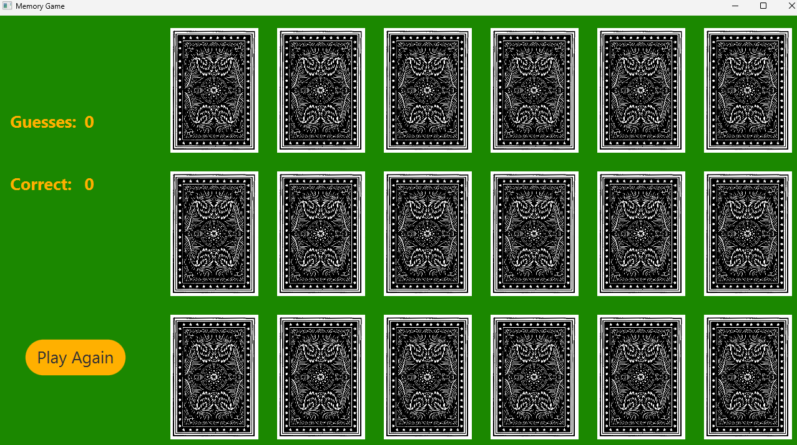

# Memory Game
This project is a implementation of the memory game with french cards in JavaFX.  
The objective of the game is to match all cards flipping it, if are not matched re-flip the card with back-facing, so you have to remember where the cards are to match them.
The game finish when all card are matched.

# Installation and Run
Clone the repository, open the project and click run in the `App.java` file.  

# How to Use
When you start the application you visualize this, you can start the game clicking the card and play memory-game

When you are finished the game, you can close or click the button and play antoher game!

# Project Structure
* `App.java`: contains the main where to start the application
* `Card.java`: contains the class that implement a card
* `Deck.java`: contains the class that implement a deck of cards
* `Deck.java`: contains the class that implement a memory card
* `MemoryGameController.java`: contains the class that implement the logic behind the game

## Contributing
Pull requests are welcome.  
For major changes, please open an issue first to discuss what you would like to change.

## License
[MIT](https://choosealicense.com/licenses/mit/)
